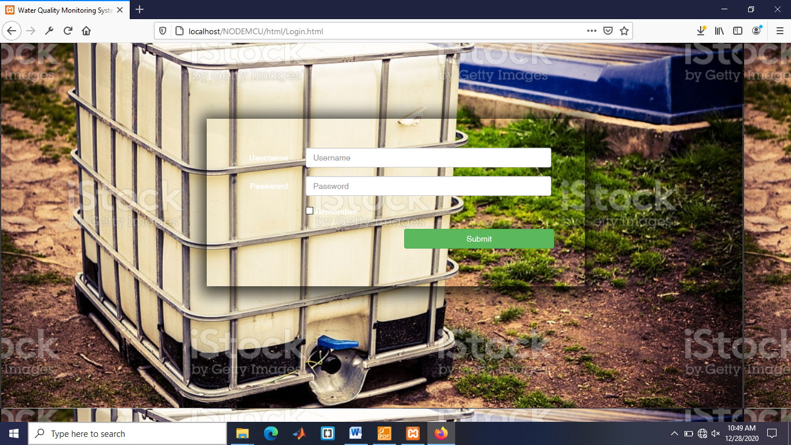
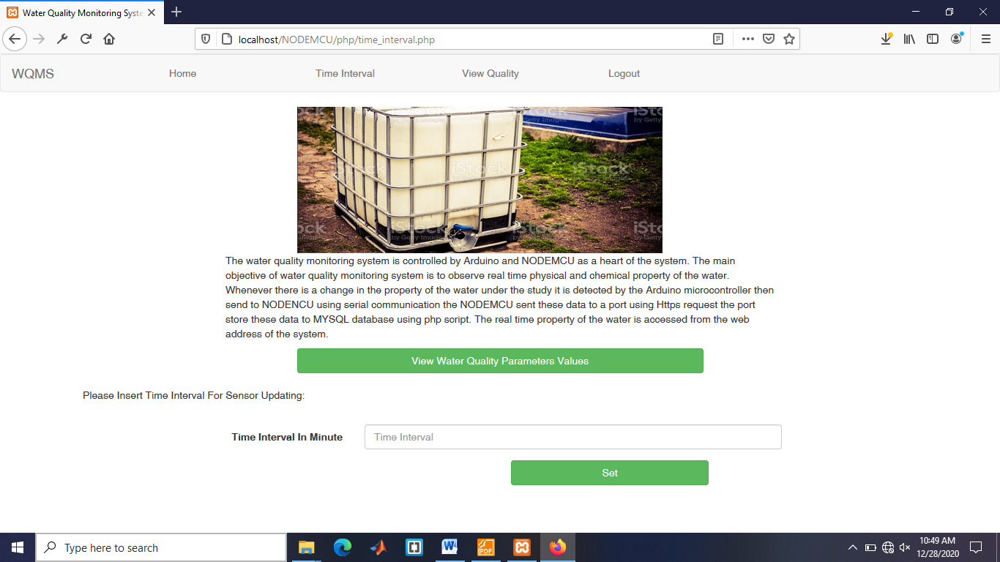
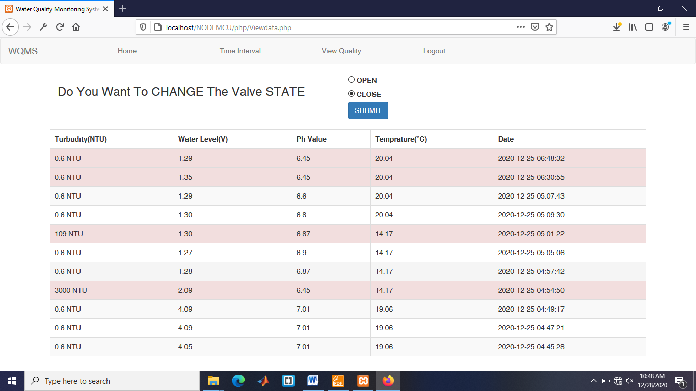
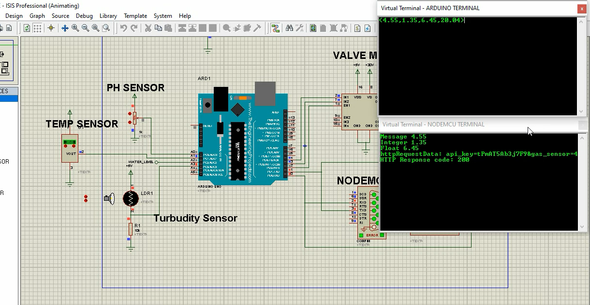

## Web based water Quality Management System
## Login page for Admin

## Home page => you can set time Interval for storing sensors reading data

## Sensor data (View current or history water of Quality )  and control using open and closing the valve

## The simulation of the circuit has been designated using Proteus Software as shown in the figure
snapshot of inserting the sensor data to MySQL database
 

Abstract
The economical and effective system of water quality observation is the most robust implementation of impure water. The impurity of water arises due to mainly water pollution, high population, fewer water resources, etc. So, different methods are used to monitor the water quality.  Traditional methods have the drawbacks such as long waiting time for results high cost, low measurement precision and complicated methodology. The existing system has high complexity and low performance. In this proposed system we use different methods and techniques by reducing complexity and increasing performance to check quality of water. To make sure that clean safe distribution of water is done, it must be observed in real time for a new method like our project called “Smart Water Quality Monitoring System Using internet of things (IoT) Technology. Microcontroller pass the processed sensor data to the WI-FI module using serial communication the data will be display to the web page.  This projected the water quality observation interface sensors with quality observation with IOT setting.  Water quality measurement (WQM) selects parameters of water like temperature, pH level, water level and turbidity. This methodology sends the information to the web server. The data updated at intervals within the server may be retrieved or accessed from anyplace within the world.  For the monitoring process, the system is achieved with reliability and feasibility by verifying the four parameters of water. Ecological environment of water resources is protected in this research. The time is reduced, and the cost is low in this environmental management

